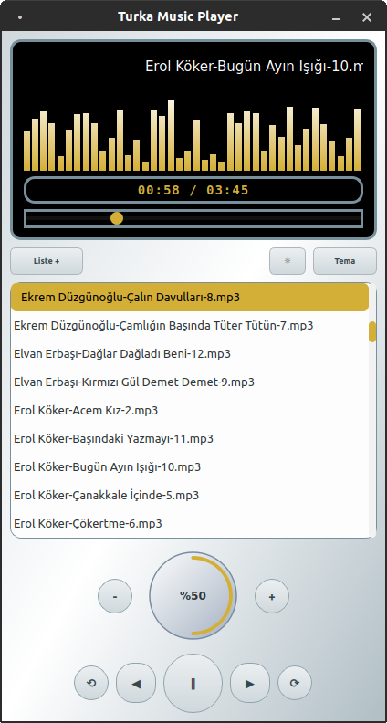

# Turka Music Player

Python ve Qt6 ile yazılmış basit ve hafif müzik çalar uygulamadır.

.mp3, .wav, .ogg, .flac, .m4a, .aac, .wma, .mp4, .opus, .aiff ses formatlarını destekler.

Debian tabanlı sistemler için .deb dosyası download link: https://github.com/03tekno/PyAmp/releases/tag/current

